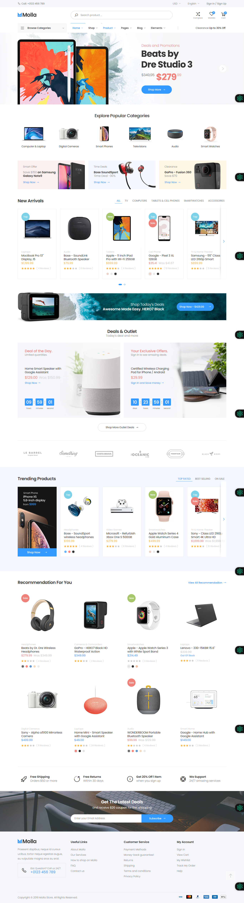

# E-commerce Website !

**Exploring laravel 12 New Version** with **CRUD In Laravel**. It's a project about **E-commerce** website. Using **Breeze** in Laravel.

## Table of Contents

-   [Author](#author)
-   [Features](#features)
-   [Has Been Used](#has-been-used)
-   [View In Short](#view-in-short)
-   [Contact](#contact)

## Author

[Fatema Akther Prianka 🤗](https://github.com/Prianka-Mimi)

## Features

-   Blade Templating - HTML template integration in Laravel

-   Breeze - Authentication

## Has Been Used

-   Html
-   css
    -   Bootstarp
-   JavaScript
    -   JQuery (Password Toggle)
-   Laravel
    -   Breeze   

##  Breeze Installation
```
composer require laravel/breeze --dev
```

⚠️ **If compatibility warning (Most likely!)**

```
composer require laravel/breeze:dev-main --dev
```

⭐ **```dev-main``` branch is not a stable release, but it's compatible with Laravel 12 in Breeze.
That's why not mentioned in official Laravel 12 documentation.**

👉 **Laravel Breeze GitHub Repo : 🔗 https://github.com/laravel/breeze**

👉 **Laravel 12 Official Documentation : 🔗 https://laravel.com/**

👉 **Laravel 11 Official Documentation Breeze : 🔗 https://laravel.com/docs/11.x/starter-kits#laravel-breeze**

**Then**

```
php artisan breeze:install blade
```

**OR**

```
php artisan breeze:install vue
```

**OR**

```
php artisan breeze:install react
```

**Then**

```
npm install && npm run dev
```

**Then**

```
php artisan migrate
```

**Then**

```
php artisan serve
```

**Here You Go 😉**

## View In Short

**Home Page**



## ✨ Contact

<div align="left">
  <a href="https://webdeveloperprianka.netlify.app/" target="_blank"> 
    
  </a>
  <a href="https://www.linkedin.com/in/fatema-akther-prianka/" target="_blank">
    
  </a>
  <a href="https://stackoverflow.com/users/23182049/prianka-mimi" target="_blank">
    
  </a>
  <a href="https://leetcode.com/u/prianka-mimi/" target="_blank">
  
  </a>
    <a href="mailto:priankamimi0204@gmail.com" target="_blank">
    
  </a>
  <a href="https://discord.com/channels/@me" target="_blank">
    
  </a>
  <a href="https://www.facebook.com/fatemaaktherprianka.webdeveloper" target="_blank">
    
  </a>
</div>
